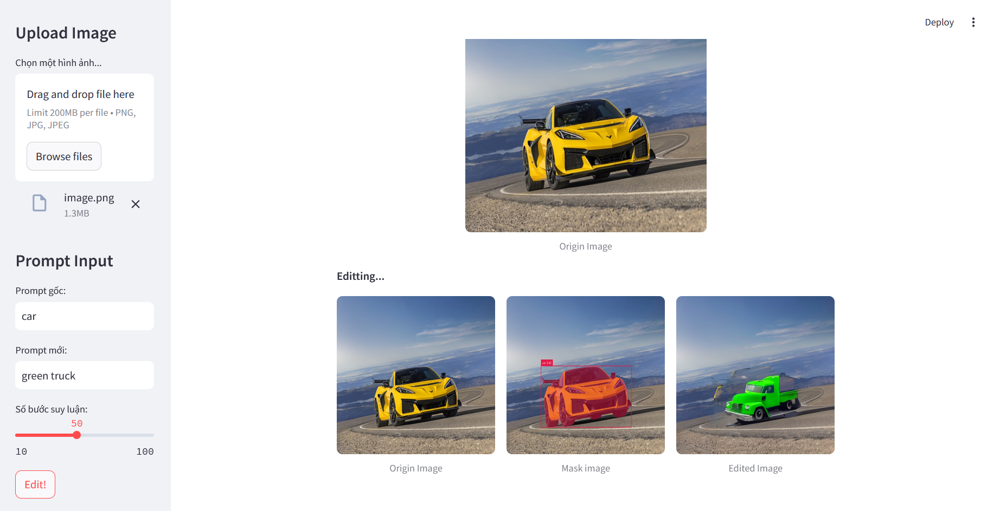
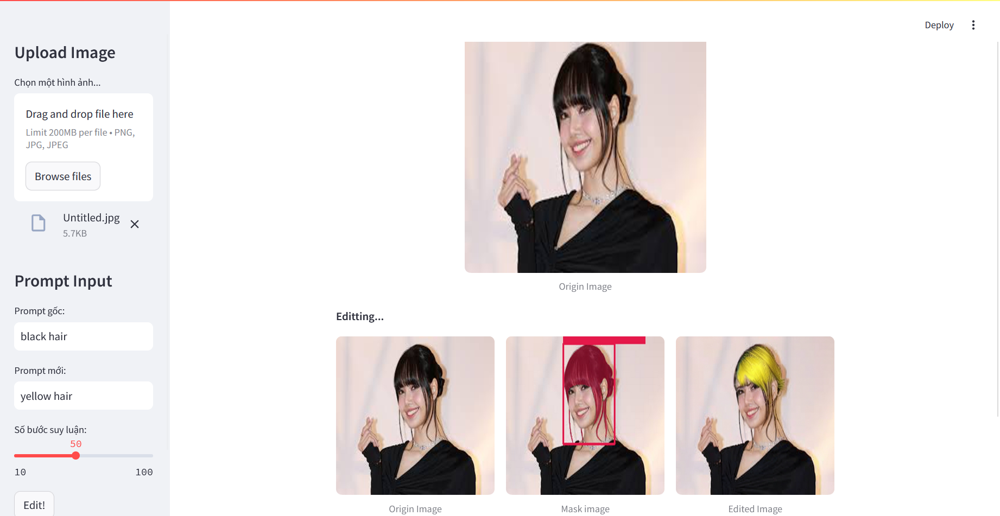
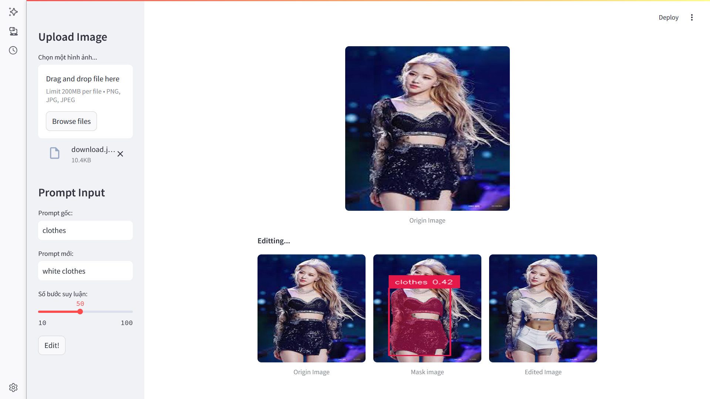
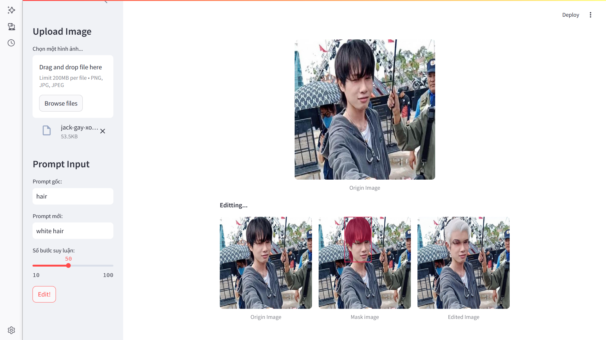

# VisualEdition

## Ground and Segment Anything: Using Grounded SAM 2

## Inpainting: Using Stable Diffusion + ControlNet

### Installation
Follow the installation guide at [IDEA-Research/Grounded-SAM-2](https://github.com/IDEA-Research/Grounded-SAM-2)

### Demo
Run the following command to start the demo:
```bash
CUDA_VISIBLE_DEVICES=0 streamlit run demo.py --server.address 0.0.0.0
```

### Example Images
The demo uses the following example images:






---
This guide helps you install and run Grounded SAM 2 for image processing with Stable Diffusion and ControlNet.

